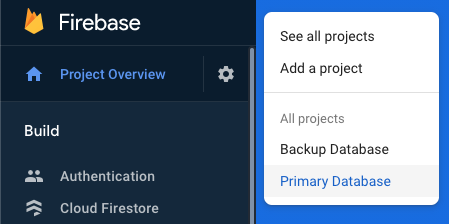
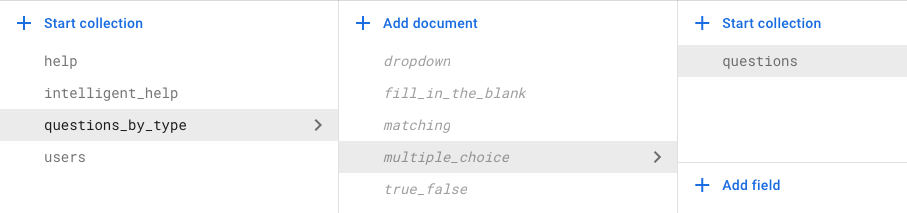
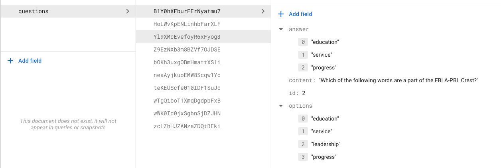

# Data Description and snapshot

Dataset contains more than 50 questions of 5 different types
* True/False
* Fill in the blanks
* Matching
* Dropdown
* Multiple Choice
  * Questions with one answers (shown in form of a radio button)
  * Questions with multiple answers (shown in form of check boxes to select multiple)

Data is persistently stored in [Cloud Firestore](https://firebase.google.com/products/firestore), a document oriented NoSQL database by Google. The application supports dynamic backup feature where data is written asynchronously to a primary database instance and a backup database instance.

Below is a screenshot of how primary and backup database look like in firestore.



The data itself is stored in form of a tree structure where the root of the data is a collection of questions and each question type as child document. Each question type document further contains a collection of questions. 

Below is how sample data looks like for multiple choice questions in Firestore.

Questions By Type


Questions

The document in the extreme right in the above image contains an actual question. "options" represents all the options that would be presented to the user. "answers" represents the correct answers.

## Data Snapshot
Below is complete data of questions and answers extracted from the firestore database in JSON format.
### Question Type: DropDown
"options": All the options presented to the user in the dropdown.  
"id": id to be used for randomizing and selecting a question randomly.  
"content": Actual question to be asked from the user.  
"answer": Correct Answer.  
```
{
    "options": [
        "FBLA Creed",
        "FBLA Pledge",
        "FBLA Mission statement",
        "FBLA Motto"
    ],
    "id": 0,
    "answer": "FBLA Mission statement",
    "content": " What starts off with the words, \"Our mission is to bring business and education together...\"?"
}
{
    "content": "The land for the FBLA-PBL National Center was purchased through a grant from the :",
    "options": [
        "United Business Education Association",
        "Conrad N. Hilton Foundation",
        "General Motors Corporation",
        "Virginia FBLA-PBL Foundation"
    ],
    "id": 1,
    "answer": "Conrad N. Hilton Foundation"
}
{
    "options": [
        "Mrs. Tanya Morgan",
        "Dr. Edward D. Miller",
        "Dr. Hamden L. Forkner",
        "President Franklin D. Roosevelt."
    ],
    "id": 2,
    "answer": "Dr. Hamden L. Forkner",
    "content": "The FBLA Concept was developed by____."
}
{
    "answer": "Twice",
    "content": " In debate, each member has the right to speak how many times on a motion on any one day?",
    "options": [
        "Once",
        "Twice",
        "Three times",
        "Four times"
    ],
    "id": 3
}
{
    "content": "In the last paragraph of the FBLA Creed, the following statement is made:",
    "options": [
        "I agree to do my utmost",
        "I promise to use my abilities",
        "Every person should actively",
        "Every person should prepare"
    ],
    "id": 4,
    "answer": "I promise to use my abilities"
}
{
    "content": "The first stanza of the FBLA-PBL Creed begins with which of the following words?",
    "options": [
        "I believe education is the right of every man",
        "I believe education is the right of every person",
        "I believe education is important",
        "I believe education should be free"
    ],
    "id": 5,
    "answer": "I believe education is the right of every person"
}
{
    "answer": "Earth friendly activities",
    "content": "FBLA's \"Go Green\" project recognizes one chapter in each region for its:",
    "options": [
        "Winning essays",
        "Collection of the most \"tabs\" from cans for Ronald McDonald House",
        "Earth friendly activities",
        "Recycling projects"
    ],
    "id": 6
}
{
    "content": "FBLA Middle level membership is open to students in what grades? ",
    "options": [
        "9-12",
        "7-12",
        "8-9",
        "5-9"
    ],
    "id": 7,
    "answer": "5-9"
}
{
    "answer": "March of Dimes",
    "content": "Which community service opportunity is most often associated with FBLA?",
    "options": [
        "March of Dimes",
        "American Red Cross",
        "Children's Miracle Network",
        "Habitat for Humanity"
    ],
    "id": 8
}
{
    "content": "FBLA-PBL Week is held each year during which month?",
    "options": [
        "January",
        "February",
        "August",
        "December"
    ],
    "id": 9,
    "answer": "February"
}
{
    "content": "Phi Beta Lambda (PBL) is the division for which group of students?",
    "options": [
        "Elementary",
        "Middle School",
        "College",
        "High School"
    ],
    "id": 10,
    "answer": "College"
}
{
    "content": "The local chapter with over 100 members is entitled to how many local voting delegates at the National Leadership Conference?",
    "options": [
        "2",
        "3",
        "4",
        "5"
    ],
    "id": 11,
    "answer": "4"
}
{
    "content": "What is the name of the program offered in conjunction with the National Leadership Conference that is offered to state, and local FBLA-PBL officers, members, and advisers for Leadership Development and Training?",
    "options": [
        "Management Series 2000",
        "Leadership Training Institute",
        "Institute for Leaders",
        "The Institute"
    ],
    "id": 12,
    "answer": "Institute for Leaders"
}
{
    "answer": "Hollis and Kitty Guy",
    "content": "The Gold Seal Award of Merit is named after",
    "options": [
        "Jean Buckley",
        "Hamden Forkner",
        "Hollis and Kitty Guy",
        "Dorothy Travis"
    ],
    "id": 13
}
{
    "answer": "1940",
    "content": "In what year was FBLA-PBL officially sponsored by the National Council for Business Education?",
    "options": [
        "1937",
        "1940",
        "1942",
        "1941"
    ],
    "id": 14
}
{
    "content": "Where are FBLA-PBL headquarters?",
    "options": [
        "Wisconsin",
        "North Carolina",
        "California",
        "Virginia"
    ],
    "id": 15,
    "answer": "Virginia"
}
{
    "content": " Who ensures that the election of national officers at the NLC follows correct procedure and the FBLA or PBL national bylaws?",
    "options": [
        "National Parliamentarian",
        "National President",
        "National Secretary",
        "Vice President"
    ],
    "id": 16,
    "answer": "National Parliamentarian"
}
```

### Question Type: Multiple Choice.  
"options": All the options presented to the user in the form of checkbox (if multiple answers) and radiobuttons (if one answer).    
"id": id to be used for randomizing and selecting a question randomly.  
"content": Actual question to be asked from the user.  
"answer": Correct Answer. (Can have multiple answers).  
```
{
    "answer": [
        "education",
        "service",
        "progress"
    ],
    "content": "Which of the following words are a part of the FBLA-PBL Crest?",
    "options": [
        "education",
        "service",
        "leadership",
        "progress"
    ],
    "id": 2
}
{
    "answer": [
        "Indiana",
        "Ohio"
    ],
    "content": "Which 2 states were the next to become FBLA state chapters after Iowa?",
    "options": [
        "Indiana",
        "Florida",
        "Ohio",
        "Maryland"
    ],
    "id": 1
}
{
    "options": [
        "Eastern",
        "Mountain-Plains",
        "Western-Central",
        "Southern"
    ],
    "id": 3,
    "answer": [
        "Eastern",
        "Mountain-Plains",
        "Southern"
    ],
    "content": "Which  of the following are one of the administrative regions in the United States?"
}
{
    "content": "Which of the following shall be elected annually at a general session of the National Leadership Conference by the state voting delegates? ",
    "options": [
        "President",
        "Vice-Presidents",
        "Secretary",
        "Treasurer"
    ],
    "id": 4,
    "answer": [
        "President",
        "Secretary",
        "Treasurer"
    ]
}
{
    "answer": [
        "Vice President",
        "Parliamentarian",
        "Secretary"
    ],
    "content": "Which of the following national officers do not serve as chairman of the national executive council?",
    "options": [
        "President",
        "Vice President",
        "Parliamentarian",
        "Secretary"
    ],
    "id": 5
}
{
    "options": [
        "Tomorrow\u2019s Business Leader",
        "The Professional Edge",
        "Advisers\u2019 Hotline",
        "PBL Business Leader"
    ],
    "id": 8,
    "answer": "PBL Business Leader",
    "content": "The exclusive publication for PBL members who are about to launch their careers in business is:"
}
{
    "content": "The third FBLA-PBL Goal is to create more:",
    "options": [
        "interest in and understanding of American business enterprise",
        "interest in and understanding of the free enterprise system",
        "understanding of American business enterprise",
        "interest in American business enterprise"
    ],
    "id": 6,
    "answer": "interest in and understanding of American business enterprise"
}
{
    "answer": [
        "blue",
        "gold"
    ],
    "content": "The two official colors of FBLA-PBL are which of the following?",
    "options": [
        "red",
        "black",
        "blue",
        "gold"
    ],
    "id": 0
}
{
    "answer": "Iowa",
    "content": "Which state became the first FBLA state chapter?",
    "options": [
        "Florida",
        "Wisconsin",
        "Iowa",
        "Ohio"
    ],
    "id": 9
}
{
    "content": "Which of the following is not an official publication of FBLA-PBL?",
    "options": [
        "Tomorrow's Business Leader",
        "FBLA Adviser's Hotline",
        "The PBL Business Leader",
        "Business Leaders of Tomorrow"
    ],
    "id": 7,
    "answer": "Business leaders of Tomorrow"
}
```

### Question Type: Matching
"question": "left_side" contains the left side to match and "right_side" contains the right side of matching.  
"id": id to be used for randomizing and selecting a question randomly.  
"content": Actual question to be asked from the user.  
"answer": Correct Answers (Matching).  
```
{
    "id": 0,
    "answer": {
        "Texas": "Mountain Plains Region",
        "Maine": "Eastern Region",
        "Ohio": "North Central Region",
        "California": "Western Region",
        "North Carolina": "Southern Region"
    },
    "question": {
        "left_side": [
            "Maine",
            "Texas",
            "Ohio",
            "North Carolina",
            "California"
        ],
        "right_side": [
            "Southern Region",
            "Western Region",
            "Mountain Plains Region",
            "North Central Region",
            "Eastern Region"
        ]
    },
    "content": "Match the states to their FBLA Regions"
}
{
    "question": {
        "left_side": [
            "Iowa becomes the first FBLA state chapter.",
            "Phi Beta Lambda (PBL), is created.",
            "FBLA\u2013Middle Level division is formed.",
            "FBLA-PBL appoints Edward D. Miller as the first full-time executive director.",
            "Jean Buckley is appointed president and chief executive officer."
        ],
        "right_side": [
            "1994",
            "1997",
            "1973",
            "1947",
            "1958"
        ]
    },
    "answer": {
        "Jean Buckley is appointed president and chief executive officer.": "1997",
        "FBLA\u2013Middle Level division is formed.": "1994",
        "Iowa becomes the first FBLA state chapter.": "1947",
        "Phi Beta Lambda (PBL), is created.": "1958",
        "FBLA-PBL appoints Edward D. Miller as the first full-time executive director.": "1973"
    },
    "content": "Match the event to the year in which it happened.",
    "id": 1
}
{
    "content": "Match the name of the publication with the FBLA members it is for",
    "id": 2,
    "question": {
        "right_side": [
            "An exclusive publication for PBL members who are  about to launch their careers in business.",
            "Publication for the members of the Professional Division.",
            "Publication for FBLA and FBLA-Middle Level students and advisers.",
            "Provides tips and techniques for running an effective FBLA, PBL, or FBLA-Middle Level chapter."
        ],
        "left_side": [
            "Tomorrow\u2019s Business Leader",
            "PBL Business Leader",
            "Advisers\u2019 Hotline",
            "The Professional Edge"
        ]
    },
    "answer": {
        "Advisers\u2019 Hotline": "Provides tips and techniques for running an effective FBLA, PBL, or FBLA-Middle Level chapter.",
        "PBL Business Leader": "An exclusive publication for PBL members who are  about to launch their careers in business.",
        "The Professional Edge": "Publication for the members of the Professional Division.",
        "Tomorrow\u2019s Business Leader": "Publication for FBLA and FBLA-Middle Level students and advisers."
    }
}
{
    "id": 3,
    "answer": {
        "Professional Division (PD)": "FBLA-PBL alumni, business professionals, and educators",
        "Future Business Leaders of America (FBLA)": "high school students",
        "Phi Beta Lambda (PBL)": "college students",
        "FBLA-Middle Level (FBLA-ML)": "junior high and middle school students"
    },
    "question": {
        "left_side": [
            "Phi Beta Lambda (PBL)",
            "FBLA-Middle Level (FBLA-ML)",
            "Professional Division (PD)",
            "Future Business Leaders of America (FBLA)"
        ],
        "right_side": [
            "junior high and middle school students",
            "FBLA-PBL alumni, business professionals, and educators",
            "high school students",
            "college students"
        ]
    },
    "content": "Match the FBLA division with its members"
}
```


### Question Type: Fill in the blank
"content": Actual question to be asked from the user.  
"id": id to be used for randomizing and selecting a question randomly.  
"answer": Correct Answer (Can be a number or text in case the answer is a number e.g. 5 or Five).  
```
{
    "content": "The FBLA concept was first developed in the year______.",
    "id": 6,
    "answer": [
        "1937"
    ]
}
{
    "content": "In order for a state to qualify for FBLA state chapter charter, there must be at least ____ active local chapters.",
    "id": 12,
    "answer": [
        "5",
        "five"
    ]
}
{
    "content": "The chapter officer that presides over and conducts meetings is typically the __________.",
    "id": 7,
    "answer": [
        "President"
    ]
}
{
    "id": 5,
    "answer": [
        "9",
        "nine"
    ],
    "content": " The number of goals that FBLA-PBL have is __."
}
{
    "answer": [
        "fbla-pbl"
    ],
    "content": "The official web address for the FBLA website is www.________.org",
    "id": 0
}
{
    "content": "The first FBLA high school chapter was organized in the year___.",
    "id": 2,
    "answer": [
        "1942"
    ]
}
{
    "answer": [
        "Progress"
    ],
    "content": "The three words on the FBLA - PBL Crest are Service, Education, and ___.",
    "id": 3
}
{
    "answer": [
        "4",
        "four"
    ],
    "content": "Tomorrow\u2019s Business Leader, the flagship publication for FBLA and FBLA-Middle Level students and advisers is published _____ times a year.",
    "id": 10
}
{
    "answer": [
        "March of Dimes"
    ],
    "content": "Many FBLA chapters collect money and sponsor activities for __________, which is the organization that does research to help prevent birth defects.",
    "id": 9
}
{
    "answer": [
        "five",
        "5"
    ],
    "content": " FBLA-PBL is divided into _______ administrative regions.",
    "id": 4
}
{
    "id": 8,
    "answer": [
        "Aspire"
    ],
    "content": "FBLA-PBL membership theme for 2020-21 is _______."
}
{
    "answer": [
        "6",
        "six"
    ],
    "content": "The number of national officers who represent PBL's membership is _______.",
    "id": 13
}
{
    "answer": [
        "November 15"
    ],
    "content": "American Enterprise day is on ___",
    "id": 1
}
{
    "content": "The number of national officers who represent FBLA\u2019s membership is _______.",
    "id": 14,
    "answer": [
        "9",
        "nine"
    ]
}
{
    "content": "Of all the national officers that represent the FBLA's membership, the number of regional Vice-Presidents is________.",
    "id": 11,
    "answer": [
        "5",
        "five"
    ]
}
```

### Question Type: True / False
"content": Actual question to be asked from the user.  
"id": id to be used for randomizing and selecting a question randomly.  
"answer": Correct Answer.  
```
{
    "id": 10,
    "answer": "FALSE",
    "content": "FBLA-PBL is the second largest career student business organization in the world."
}
{
    "content": "The first FBLA-PBL goal is to develop competent, aggressive business leadership.",
    "id": 8,
    "answer": "TRUE"
}
{
    "answer": "TRUE",
    "content": "FBLA-PBL appointed Edward D. Miller as the association\u2019s first full-time executive director.",
    "id": 5
}
{
    "answer": "TRUE",
    "content": "The words \"... To profit from my mistakes and take suggestions and criticisms directed toward the improvement of myself and my work\" are taken from the FBLA Code of Ethics.",
    "id": 9
}
{
    "id": 2,
    "answer": "TRUE",
    "content": " The fiscal year of FBLA-PBL is July 1-June 30."
}
{
    "content": "The FBLA Middle Level Division was established in the year 1994.",
    "id": 1,
    "answer": "TRUE"
}
{
    "content": "Robert's Rules of Order - Newly Revised is FBLA-PBL's official parliamentary authority.",
    "id": 3,
    "answer": "TRUE"
}
{
    "id": 12,
    "answer": "TRUE",
    "content": "No two national officers shall be elected from the same state chapter."
}
{
    "content": "An outline written every August by FBLA state executive boards to list and details the state chapter's tasks and goals of the year is called The Program of Work.",
    "id": 7,
    "answer": "TRUE"
}
{
    "content": "The term of office for a National Officer begins at the close of the National Leadership Conference in which they were elected. ",
    "id": 6,
    "answer": "TRUE"
}
{
    "answer": "TRUE",
    "content": "All voting delegates of local and state chapters must be submitted to the national office no later than 20 days prior to the National Leadership Conference.",
    "id": 0
}
{
    "answer": "TRUE",
    "content": "The publication that Professional Division membership receives is called The Professional Edge . ",
    "id": 11
}
{
    "answer": "FALSE",
    "content": "A local chapter with 50 members would be entitled to 4 local voting delegates at the National Leadership Conference.",
    "id": 4
}
```
